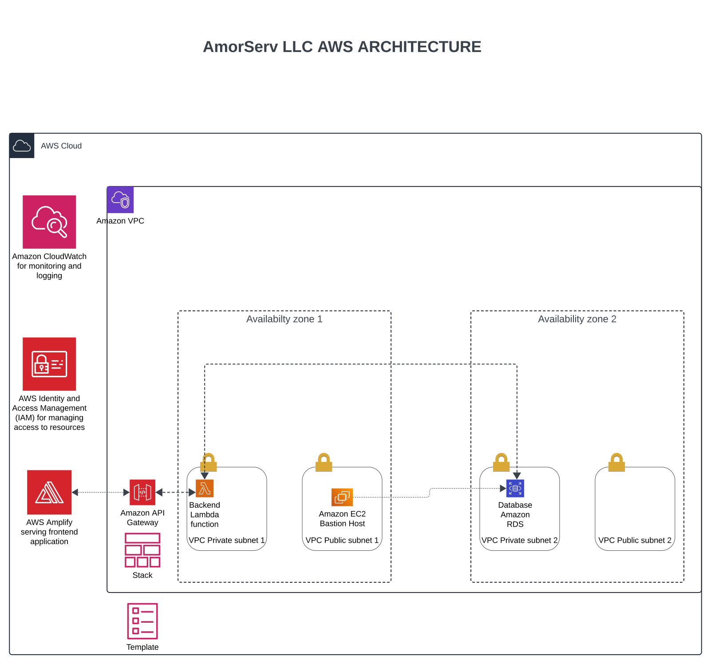

# AWS Infrastructure and CI/CD Pipeline Setup

## Introduction

This document outlines the design and implementation of a highly available and scalable web application on AWS, including infrastructure provisioning, CI/CD pipeline setup, and monitoring configurations.

## Architecture Design and Provisioning

### Architecture Diagram AmorServ LLC

### Infrastructure Components

#### VPC and Subnets

##### Create a new VPC.

###### Settings:

- Name: MyVPC
- IPv4 CIDR block: 10.0.0.0/16
- Enable DNS hostnames: Yes
- Enable DNS support: Yes

##### Create Subnets:

- Action: Create four subnets within the VPC.

###### Settings:

- Public Subnet 1:
  Name: PublicSubnet1
  Availability Zone: us-east-1a
  IPv4 CIDR block: 10.0.1.0/24
- Public Subnet 2:
  Name: PublicSubnet2
  Availability Zone: us-east-1b
  IPv4 CIDR block: 10.0.2.0/24
- Private Subnet 1:
  Name: PrivateSubnet1
  Availability Zone: us-east-1a
  IPv4 CIDR block: 10.0.3.0/24
- Private Subnet 2:
  Name: PrivateSubnet2
  Availability Zone: us-east-1b
  IPv4 CIDR block: 10.0.4.0/24

##### Action: Create an Internet Gateway and attach it to the VPC.

###### Settings:

- Name: MyInternetGateway

##### Action: Create route tables for the public and private subnets.

###### Settings:

- Public Route Table:
  Name: PublicRouteTable
  Routes: 0.0.0.0/0 pointing to the Internet Gateway
  Associate with PublicSubnet1 and PublicSubnet2
- Private Route Table:
  Name: PrivateRouteTable
  Routes: No default route
  Associate with PrivateSubnet1 and PrivateSubnet2
- EC2 Instance (Bastion Host)
  Launch EC2 Instance:
  Action: Create an EC2 instance in one of the public subnets.

###### Settings:

Name: BastionHost
AMI: Amazon Linux 2
Instance Type: t2.micro
Subnet: PublicSubnet1
Security Group: Allow SSH (port 22) from your IP address

#### AWS Lambda Functions for the backend services

- **Function**: Node.js backend services deployed in private subnets.
- **API Gateway**: Exposing Lambda functions as HTTP endpoints.

###### Settings:

- Name: MyBackendLambda
- Runtime: Node.js 14.x
- Role: Create a new role with basic Lambda permissions
- VPC: MyVPC
- Subnet: PrivateSubnet1, PrivateSubnet2
- Security Group: Allow necessary inbound/outbound traffic

#### Launch a MySQL RDS instance in the private subnets

- **Instance**: MySQL RDS instance in private subnets.
- **Security**: Configured with Multi-AZ for high availability.

###### Settings:

- Name: MyRDSInstance
- Engine: MySQL
- Instance Class: db.t3.micro
- Multi-AZ Deployment: Yes
- Subnet Group: Include PrivateSubnet1 and PrivateSubnet2
- Security Group: Allow inbound MySQL traffic (port 3306) from the Lambda security group

### Infrastructure as Code (IaC)

#### Deploying the CloudFormation Stacks

There are 6 six stacks to be deployed which involves:

1. VPC and Subnets Script (vpc.yaml)
2. Lambda Functions Script (lambda.yaml)
3. RDS Instance Script (rds.yaml)
4. Amplify Deployment Script (amplify.yaml)
5. API Gateway Script (api-gateway.yaml)
6. IAM Roles and Policies Script (iam.yaml)

###### To deploy these stacks, follow these steps:

- Upload the YAML files to S3 (if needed for cross-referencing).
- Create a CloudFormation stack for each script:
- Navigate to the AWS CloudFormation console.
- Click "Create stack" and select "With new resources (standard)".
- Upload the respective YAML file and follow the prompts to create the stack.
  Repeat for each script.

### Set Up AWS CodePipeline

AWS CodePipeline orchestrates the steps required to build, test, and deploy your application whenever there is a code change. Here’s how to set it up:

#### Create a CodePipeline:

- Open the AWS Management Console and navigate to AWS CodePipeline.
- Click "Create pipeline".
- Enter a pipeline name and click "Next".

###### Source Stage:

- Choose "Source provider" (e.g., GitHub).
- Connect your GitHub repository and select the repository and branch you want to use.
- Click "Next".

###### Build Stage:

- Choose "Add build stage" and select "AWS CodeBuild".
- If you don't have an existing CodeBuild project, create a new one.
- Click "Next".

###### Deploy Stage:

- Add multiple deploy stages:
- Frontend Deploy: Use AWS Amplify.
- Backend Deploy: Use AWS Lambda.

###### Review and Create:

- Review your pipeline configuration and click "Create pipeline".

### Set Up AWS CodeBuild

AWS CodeBuild compiles your source code, runs tests, and produces artifacts. Here’s how to set it up:

#### Create a CodeBuild Project:

- Navigate to AWS CodeBuild and click "Create build project".
- Enter a project name.
- Source: Connect to your GitHub repository.
- Environment: Choose a managed image (e.g., aws/codebuild/standard:4.0) and select the appropriate runtime (e.g., Node.js).

###### IAM Role:

Ensure the IAM role associated with CodeBuild has the necessary permissions.

### Deploy a Frontend App:

- Navigate to the AWS Amplify console.
- Click "Get Started" under "Deploy".
- Connect to your GitHub repository and select the repository and branch.
- Amplify will automatically detect the build settings and create a buildspec.yml if needed.

### Set Up Monitoring and Logging with CloudWatch

AWS CloudWatch monitors your AWS resources and applications. Here’s how to set it up:

#### Enable CloudWatch Logs for Lambda:

- Ensure your Lambda function has permissions to write logs to CloudWatch.
- Logs are automatically pushed to CloudWatch under /aws/lambda/function-name.

##### Create Custom Metrics and Alarms:

- Use CloudWatch to create custom metrics and set alarms for critical metrics (e.g., invocation errors, latency).

#### Set Up SNS for Notifications:

Create an SNS topic and subscribe to it for receiving alarm notifications.
